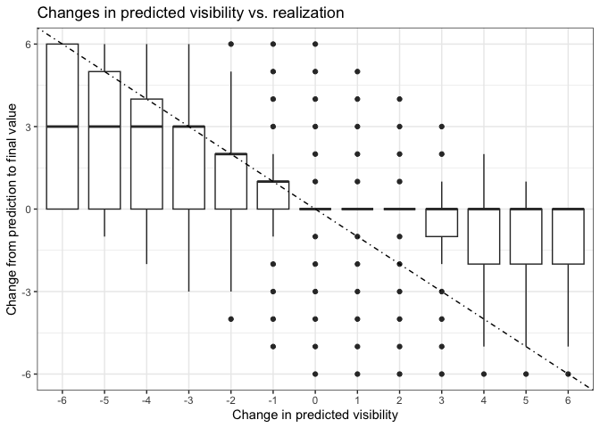
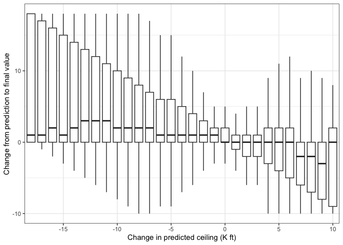
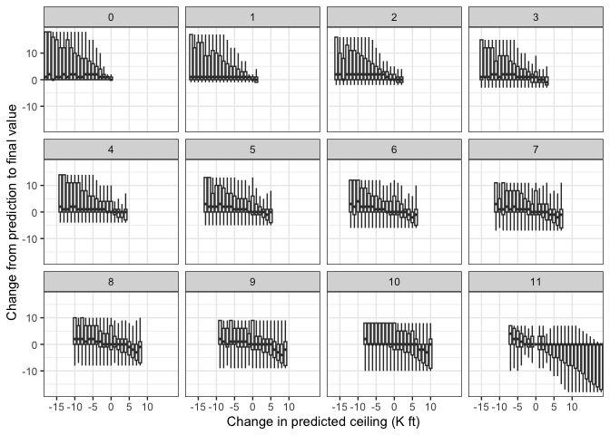

For now, this is just same sample analysis as a framework.

# Some Summary Statistics

We have loaded 139376801 data lines for 713 aerodromes for configuration
full_set.

## Distribution of Wind Speeds

# Autocorrelations

Now to the interesting part, the autocorrelations.

## Wind speed

We’ll start with looking at changes in wind speed from the previous to
the current TAF as predictors of wind speed in the final TAF reported
for a given hour. The data are filtered to cases where the wind speed in
the previous TAF, the current TAF as well as the final TAF did not
exceed 30 knots so as to filter out cases of extreme weather and
transmission errors, which may be hard to distinguish.

We notice a distinctive asymmetry in this plot. Whereas for reductions
in predicted wind speed, we hardly see much predictive value, increases
in predicted wind speed seem to be overly aggressive in the sense of the
predictions not usually coming true.

It seems that for increases in predicted wind speed of 25 knots or more,
we can back these out entirely, so these may reflect transmission
errors. For smaller increases, however, we can back out about a third of
the increase for the median, with about equal changes that we can beack
out the entire change or that the change will come substantially true.

Repeating the analysis by year, we see that the pattern appears largely
unchanged.

## Visibility

Visibility is another prominent feature of TAFs. Looking at the
autocorrelations of predictions, again we see a striking assymmetry.
Predicted improvements tend to come true, but predicted worsened
visibility tends to be pessimistic.

## Ceiling

Looking at changes in the prediction of ceilings, we don’t see a pattern
as obvious as for wind or visibility. On the median, such changes
usually do not come true, for better or for worse. However, changes in
the prediction for better or for worse are highly indicative of the
forecast being uncertain.

However, changes in ceiling do not mean the same thing when the
predicted ceiling is 100 ft vs. 12,000 ft. If we break it down by
currently predicted ceiling rounded to the nearest 1000 ft, a pattern
begins to emerge for intermediate predictions: Here improvements tend to
be optimistic, but worsening predictions tend to come true.

