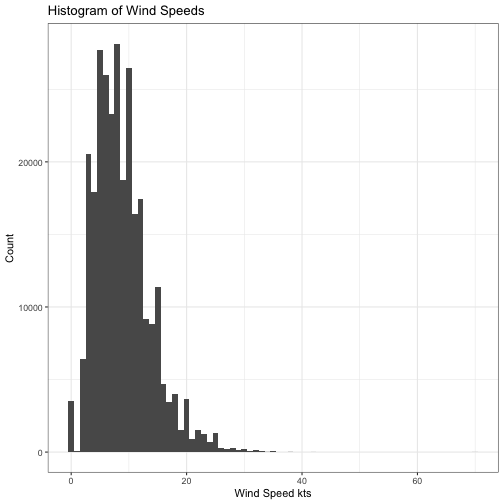
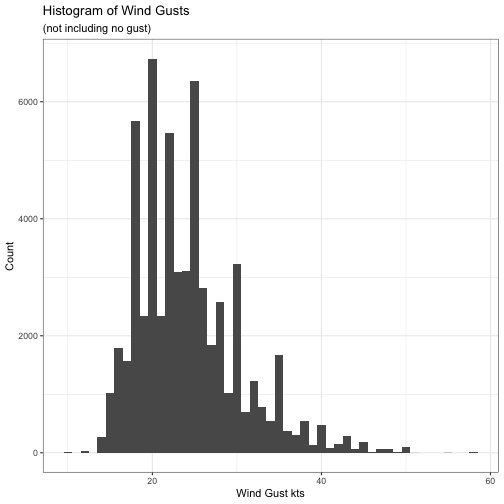
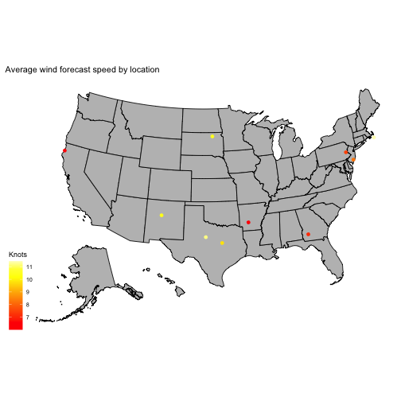

For now, this is just same sample analysis as a framework.

# Some Summary Statistics

We have loaded 286630 data lines for 10 aerodromes for configuration tiny_data.

## Distribution of Wind Speeds

